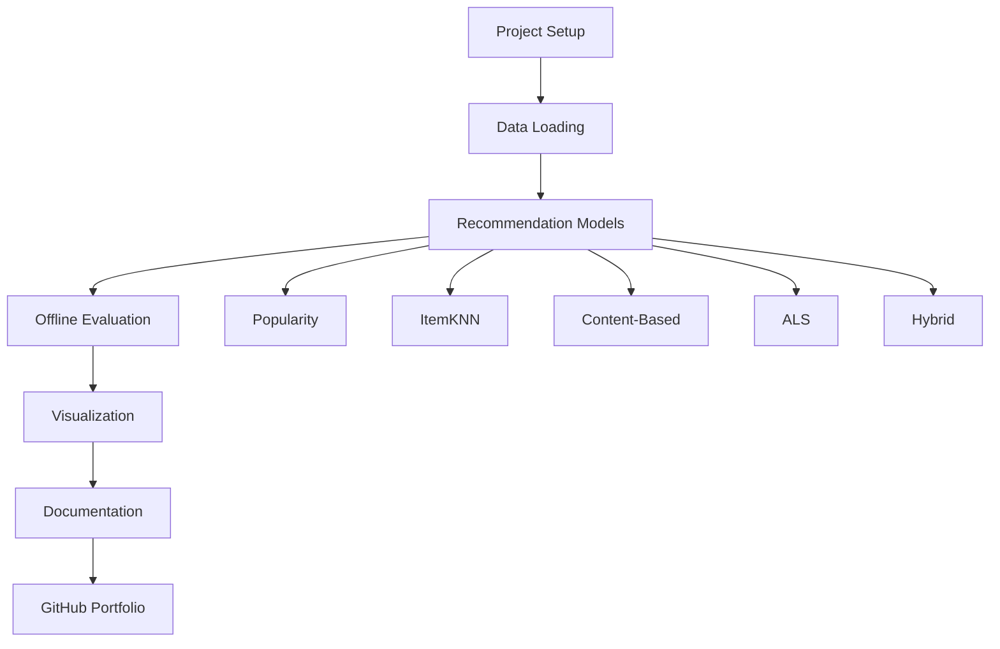
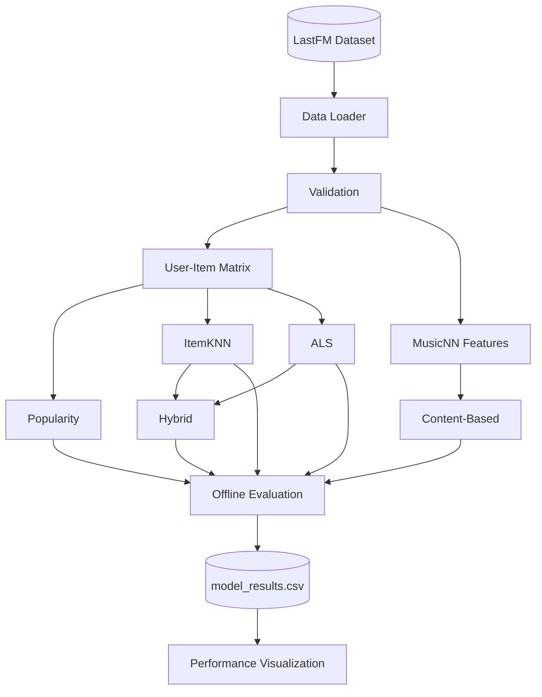

## 🗺️ Project Roadmap



### Development Status

| Component | Status |
|------------|--------|
| Project Structure | ✅ Completed |
| Data Loading | ✅ Completed |
| Evaluation Framework | ✅ Completed |
| Popularity Model | ✅ Completed |
| ItemKNN | ✅ Completed |
| Content-Based | ✅ Completed |
| ALS | ✅ Completed |
| Hybrid | ✅ Completed |
| Visualization | ✅ Completed |
| Unit Tests | ✅ 36 Passed |
| Documentation | 🟡 In Progress |
| GitHub Actions | ⏳ Planned |
| Streamlit Demo | ⏳ Planned |

---

## 🏗️ System Architecture



Every recommender implements the same interface:

```python
model.fit(interactions)
recommendations = model.recommend(user_id, k=10)
```

---

## 🔮 Future Work

### Evaluation

- Precision@K
- Recall@K
- nDCG@K
- Mean Average Precision (MAP)

### Recommendation Models

- Bayesian Personalized Ranking (BPR)
- LightFM
- Neural Collaborative Filtering
- Graph-based Recommendation

### Engineering

- GitHub Actions (Continuous Integration)
- Docker support
- Model persistence
- Configuration files
- Experiment tracking

### Deployment

- Streamlit Web Application
- FastAPI REST API
- Public cloud deployment
- Interactive recommendation dashboard