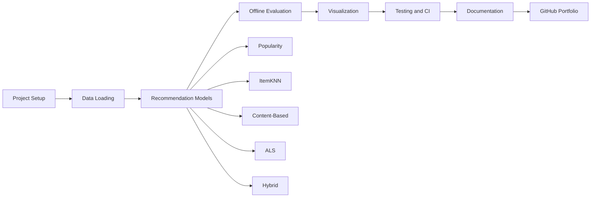

# 🎵 LastFM Music Recommender

A modular music recommendation system built in Python for implicit-feedback data, featuring Popularity, ItemKNN, Content-Based, ALS and Hybrid recommendation models.

[](https://github.com/saba-zia/lastfm-music-recommender/actions/workflows/tests.yml)


> Built as an end-to-end machine learning portfolio project with modular model design, automated evaluation, visualization, unit testing and continuous integration.

---

## ⭐ Key Features

- Modular recommendation system built with Python
- Five recommendation approaches:
  - Popularity-based
  - ItemKNN collaborative filtering
  - Content-based filtering
  - Alternating Least Squares (ALS)
  - Hybrid recommendation
- Unified interface for training and recommendation
- Offline model evaluation
- Automated performance visualization
- 36 unit tests
- Continuous Integration with GitHub Actions
- Standard `src`-based Python package structure

---

## 🗺️ Project Roadmap



---

## ✅ Project Status

| Area | Status |
|------|--------|
| Project Structure | ✅ Completed |
| Data Loading and Validation | ✅ Completed |
| Popularity Recommender | ✅ Completed |
| ItemKNN Recommender | ✅ Completed |
| Content-Based Recommender | ✅ Completed |
| ALS Recommender | ✅ Completed |
| Hybrid Recommender | ✅ Completed |
| Offline Evaluation | ✅ Completed |
| Performance Visualization | ✅ Completed |
| Unit Tests | ✅ 36 Passing |
| GitHub Actions CI | ✅ Passing |
| Documentation | 🚧 In Progress |
| Interactive Demo | 📌 Planned |

---

## 🏗️ System Architecture


---

## 💻 Unified Model Interface

All recommendation models follow a consistent interface. This makes it easier to train, compare and replace models without changing the rest of the evaluation pipeline.

```python
model.fit(interactions)

recommendations = model.recommend(
    user_id=42,
    k=10,
)
```

---

## 🧪 Testing and Continuous Integration

The repository contains automated tests for the data-loading pipeline, evaluation functions and recommendation models.

Every push and pull request to the `main` branch automatically runs the test suite through GitHub Actions.

```bash
python -m pytest -v
```

Current test status:

```text
36 passed
```

---

## 🚀 Future Work

### Evaluation

- Precision@K
- Recall@K
- nDCG@K
- Mean Average Precision
- Recommendation coverage
- Recommendation diversity

### Recommendation Models

- Bayesian Personalized Ranking
- LightFM
- Neural Collaborative Filtering
- Graph-based recommendation

### Engineering

- Docker support
- Model persistence
- Configuration management
- Experiment tracking
- Code coverage reporting

### Deployment

- Streamlit web application
- FastAPI REST API
- Interactive recommendation dashboard
- Public cloud deployment